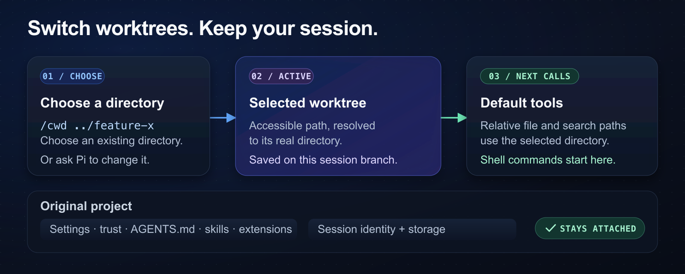

# pi-change-working-dir

Change the working directory in [Pi](https://github.com/fitchmultz/pi) without a restart. Move between Git worktrees or monorepo directories in the same session.



## Install and start

Use Pi 1.0.0 or later and Node.js 24.15 or later. Install the extension from GitHub. Start Pi.

```sh
pi install git:github.com/fitchmultz/pi-change-working-dir
pi
```

Restart Pi if it was open during installation.

## Select a directory

Enter this command in Pi. The directory must exist.

```text
/cwd ../worktrees/feature-x
```

| Command | Result |
|---|---|
| `/cwd <path>` | Select an accessible directory. |
| `/cwd` | Show the working directory. |
| `/cwd -` | Return to this run's original directory. |

Use an absolute path, a relative path, or `~`. Relative paths start at the selected directory. Pi resolves symlinks and rejects paths with control characters.

You can also ask Pi to select a directory. Pi uses the `change_dir` tool. The footer shows `cwd:` when a directory override is active.

## Which tools use the directory

Default file and search tools use the selected directory for relative paths. Absolute file paths keep their explicit target.

Default `bash` and `powershell` calls use the selected directory. Your `!` and `!!` shell commands also use it, unless an earlier custom shell handler takes ownership.

An active operation keeps its original directory. Custom tools and remote or sandbox executors need explicit integration. Editors, browsers, and subagents can use the [integration interface](docs/reference.md#extension-integration).

## Project limits

Project settings, trust, `AGENTS.md`, skills, and loaded extensions stay with the original project. Session identity and storage also stay there. Use Pi's session/project controls to change these resources.

Load this extension before path-policy extensions. Directory selection does not provide a sandbox. Read the [policy details](docs/reference.md#policy-and-shell-composition) for custom shell handlers and SDK hosts.

## Restore a directory

Pi saves the selected directory on the session branch. Resume, fork, reload, tree navigation, and compaction preserve the selection.

If a saved directory is unavailable, Pi keeps the selection and uses the original directory with a notice. Restore the directory. Run `/reload` to select it again.

If the active directory disappears, file and shell tools fail. Restore the directory or select another directory with `/cwd`. Absolute file paths also require this action.

A failed `change_dir` call stops later tool calls in the same batch. Pi can continue on the next turn.

## Update

Update the extension:

```sh
pi update --extension git:github.com/fitchmultz/pi-change-working-dir --approve
```

Use `/reload` after code changes. Restart Pi after dependency changes.

## More information

- [Reference](docs/reference.md): tool coverage, paths, integration, and model context.
- [Development](docs/development.md): local loading, tests, and compatibility coverage.
- [Changelog](CHANGELOG.md): release history.
- [Issues](https://github.com/fitchmultz/pi-change-working-dir/issues): report a problem or suggest an improvement.

## License

[MIT](LICENSE), by [Mitch Fultz](https://github.com/fitchmultz).
